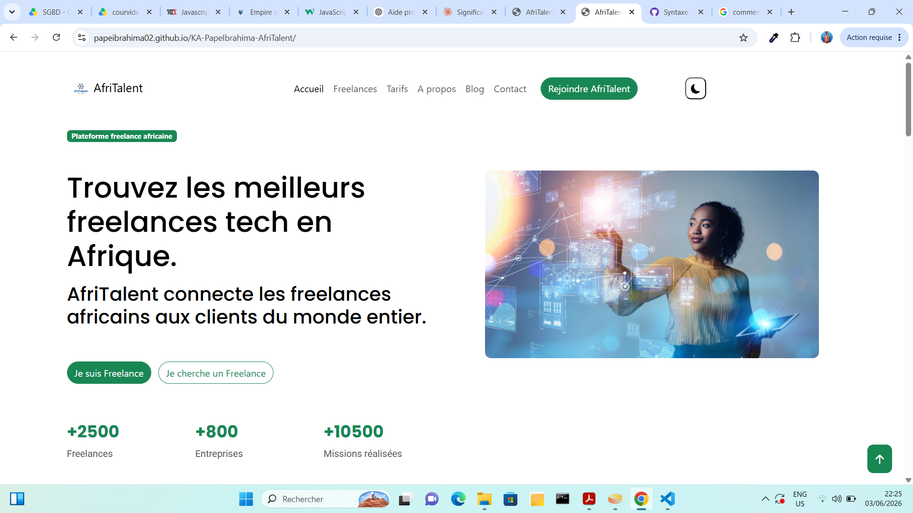

# AfriTalent
Projet fil rouge — Plateforme de mise en relation entre freelances africains et
clients.
**Auteur :** Pape Ibrahima KA
**Classe :** L1 IAGE — ISI

## Description
AfriTalent est une plateforme dédiée à connecter les freelances africains avec des entreprises à la recherche de talents qualifiés. Notre mission est de faciliter la collaboration et de créer des opportunités.

## Apercue
  

## Lien du site
[Voir le site en ligne](https://papeibrahima02.github.io/KA-PapeIbrahima-AfriTalent/)

## Technologies utilisées
- **HTML 5**
- **CSS3**
- **JavaScript**
- **Bootstrap 5**

## Fonctionnalités
- Navigation responsive avec menu hamburger sur mobile
- Mode sombre / clair avec sauvegarde de la préférence `(localStorage)`
- Compteurs de statistiques animés (de 0 à leur valeur cible) au défilement
- Animations d'apparition en fondu `(fade-in)` au scroll sur les pages Accueil et À propos
- Section témoignages en `carrousel`
- Section FAQ en `accordéon` sur la page Tarifs
- Formulaire de contact avec validation des champs
- Bouton de retour en haut de page


## Palette de couleurs
[Générateur de palettes](https://coolors.co/)
- **Couleur principale :** `--bs-green` : #198754;
- **Couleur secondaire :** `--couleur-secondaire` : #EAF8F3;
- **Couleur de fond :** `--couleur-fond` : #FFFFFF;
- **Couleur paragraphe :** `--couleur-paragraphe` : #555555;
- **Couleur titre :** `--couleur-titre` : #000000;  

## Polices utilisées
[Polices de caractères](https://fonts.google.com/)
**Titre :** `--police-titre` : `'poppins'`, sans-serif;
**Paragraphe :** `--police-paragraphe` : `'roboto'`, sans-serif;


## Images
[Images libres de droits](https://unsplash.com/) 

## Icônes
[Bootstrap Icons](https://icons.getbootstrap.com/) — icônes Bootstrap

## Arborescence du projet 
```bash
KA-PapeIbrahima-AfriTalent/
├── index.html
├── freelances.html
├── tarifs.html
├── about.html
├── contact.html
├── css/
│ └── style.css
├── js/
│ └── main.js
├── images/
│ └── (vos images, logos, avatars)
├── docs/
│ └── NOM_Prenom_Presentation.pptx
├── README.md
└── .gitignore
```

## Lancer le projet en local
- Cloner le dépôt
```bash
git clone https://github.com/PapeIbrahima02/KA-PapeIbrahima-AfriTalent.git
```
- Ouvrir le dossier du projet : **KA-PapeIbrahima-AfriTalent**
- Lancer le fichier `index.html` dans ton navigateur

## ressources consultées
[MDN Web Docs](https://developer.mozilla.org/fr/)
[W3Schools](https://www.w3schools.com/)
[Bootstrap 5 Docs](https://getbootstrap.com/docs/5.3/)
[Bootstrap Icons](https://icons.getbootstrap.com/)
[GitHub Docs](https://docs.github.com/)
[W3C Validator](https://validator.w3.org/)
[Unsplash](https://unsplash.com/)
[Coolors](https://coolors.co/)
[Google Fonts](https://fonts.google.com/)